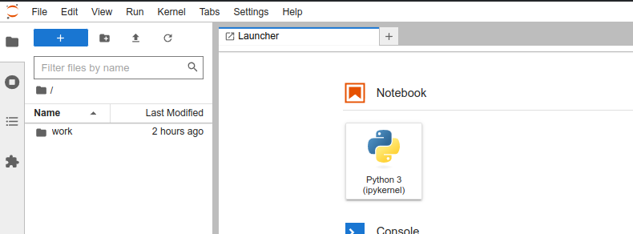

# Motivation

Basic cryptographic concepts demonstated using [PyCryptodome library](https://pypi.org/project/pycryptodome/).
Examples are organized as [Jupyter Notebooks](https://jupyter.org/) and the entire runtime environment is enclosed in a 
[Docker](https://www.docker.com/) image. So you need Docker for the follwing instructions to work.

# How to use it?

* Install [Docker](https://www.docker.com/) on your local machine.
* Clone this repository
	```
	git clone https://github.com/pzktit/CryptoNotebooks
	cd CryptoNotebooks
	```
* Run the following
	```
	docker-compose up -d
	```
	The above will download a the required docker image and create a running container.
* Point your browser to the address [http://localhost:8888](http://localhost:8888).
  You will be asked for the token. Please enter "``password``".
* You should see the Jupyter Lab. 
  
	
 
  The ``work`` folder is mapped to the folder ``CryptoNotebooks``.
  The container will be running until ShutDown a the lab (``File->ShutDown``).

# Usefull links

* [Jupyter Notebooks](https://jupyter.org/) are similar MathCAD or Mathematica interface. [Here you can find a gentle tutorial how to interact with the notebook](https://jupyter-notebook.readthedocs.io/en/latest/).

# Advanced

You can customize a docker image used for running notebooks. Please visit [CryptoNotebooks repository](https://github.com/pzktit/CryptoNotebooks).

